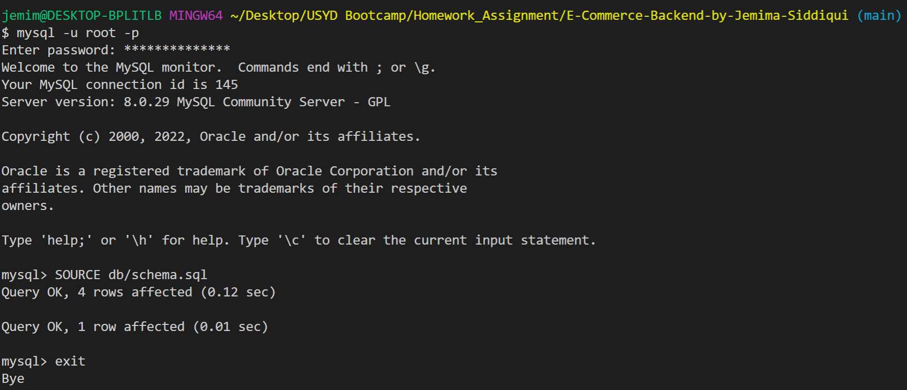
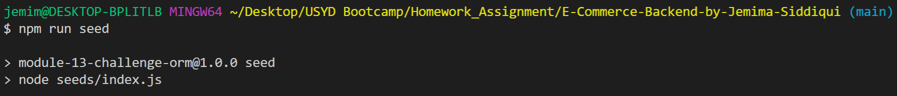
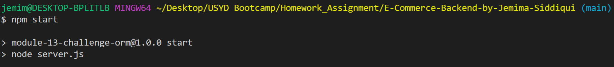
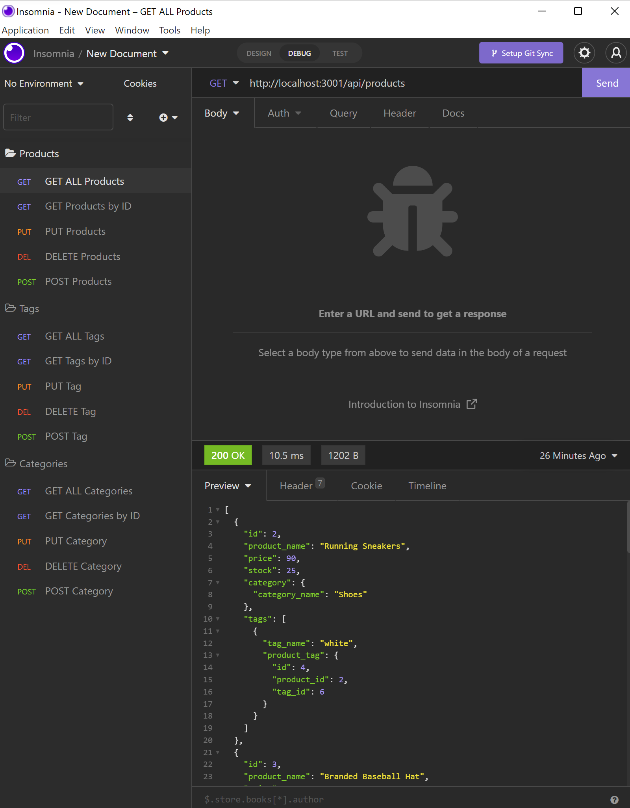

# E-Commerce-Backend-by-Jemima-Siddiqui

## Description
Internet retail, also known as e-commerce, is the largest sector of the electronics industry, generating an estimated $29 trillion in 2019. E-commerce platforms like Shopify and WooCommerce provide a suite of services to businesses of all sizes. Due to their prevalence, understanding the fundamental architecture of these platforms will benefit you as a full-stack web developer.

This project consists of a back end for an e-commerce website. This application has been developed by using Express.js API and Sequelize to interact with a MySQL database.

## Table of Contents
* [Installation](#installation)
* [Usage](#usage)
* [Questions](#questions)

## Installation

### Downloading Visual Studio Code 

 Download the latest version of Visual Studio to your local machine (Mac, Linux or Windows). Please use the following link to download the latest version of VS Code [Download VS Code](https://code.visualstudio.com/download). 

### Pulling the repository from Git 

If you would like to acess the source code, please navigate to the following public Github repository [Github Repository](https://github.com/JemimaSiddiqui/E-Commerce-Backend-by-Jemima-Siddiqui.git). 

* Clone the repository to your local desktop using the following steps:

  * 🔑 Use the terminal command `cd` to navigate to the directory where we want the repository located. In this case, we will save it to the Desktop. 

  ```bash
  cd Desktop
  ```

  * 🔑 Use the git command `git clone` followed by the URL copied from Github to clone the repo to our local machine.

  ```bash
  git clone <url>
  ```

  * 🔑 Use the `git clone` command creates a new directory with the same name as the repository. We navigate into our new directory using `cd`.

  ```bash
  cd E-Commerce-Backend-by-Jemima-Siddiqui
  ```
* After the repository has been cloned to your local machine, open the files using Visual Studio application. 

## Usage
In order to see a demonstration of this application, navigate to the following link: [https://www.youtube.com/watch?v=1wuI_BKbi78](https://www.youtube.com/watch?v=1wuI_BKbi78).


* Step 1: Change into the directory of the application 
* Step 2: Run by using the following command in the command terminal in VS Code

 ```bash
  mysql -u root -p
  ```

  ```bash
  SOURCE db/schema.sql 
  ```

* Step 3: Type "exit" to come out of the sql shell
```bash
  exit
  ```



* Step 4: Run the following seed command 

   ```bash
  npm run seed
  ```



* Step 5: Invoke the application, by running the following command 

   ```bash
  npm start
  ```

  

* Step 6: You can then use Insomnia to for GET, POST, PUT, and DELETE requests. Refer to the [demonstration video](https://www.youtube.com/watch?v=1wuI_BKbi78) for a detailed run-down. 


    
## Questions
Author: [JemimaSiddiqui](https://github.com/JemimaSiddiqui)

If you have any further questions, please feel free to contact me at: [jemimasiddiqui12@gmail.com](mailto:jemimasiddiqui12@gmail.com)
